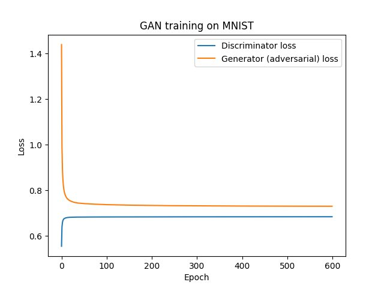
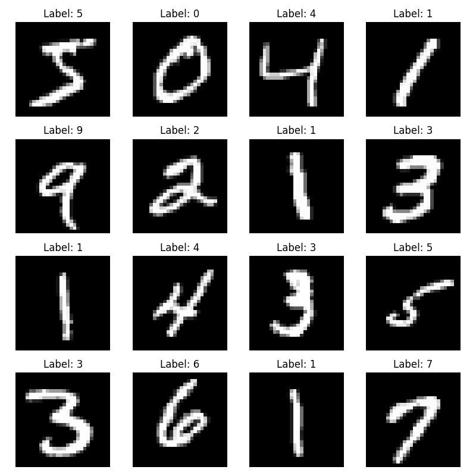
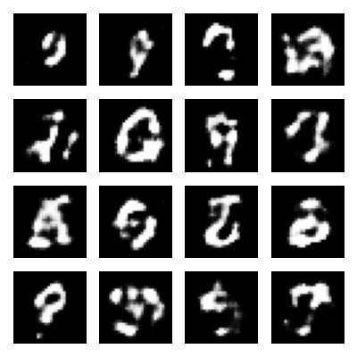
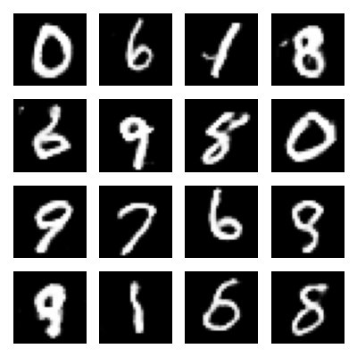
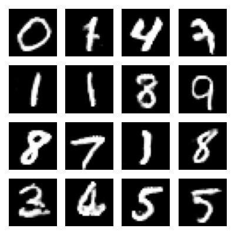
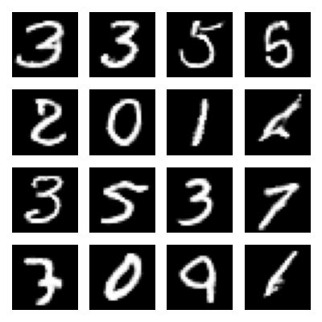
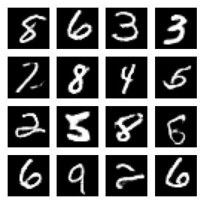
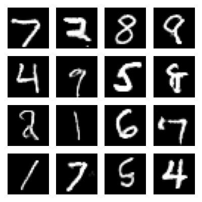

# GAN for MNIST Digit Generation

Convolutional GAN trained on MNIST to synthesize handwritten digits from random noise vectors. Course project for CSCI 8110 implementing adversarial training from scratch in TensorFlow/Keras, evaluated through progressive epoch checkpoints.

---

## Architecture

| Component | Design |
|---|---|
| Generator input | 100-dim latent vector sampled from N(0,1) |
| Generator upsampling | Dense → 7×7×192, Conv2DTranspose ×3 (96, 48, 24 filters), Conv2D output |
| Generator output | 28×28×1 sigmoid activation, values in [0, 1] |
| Discriminator | Conv2D ×4 (32→64→128→256), LeakyReLU + 40% Dropout, Dense sigmoid |
| Loss | Binary cross-entropy (both models) |
| Optimizer | Adam (lr=0.0002, β₁=0.5) — standard DCGAN settings |
| Batch size | 128 |
| Epochs | 600 |

---

## Training Results

| Checkpoint | D Loss | G Loss | Visual Quality |
|---|---|---|---|
| Epoch 1 | ~0.56 | ~1.45 | Noise blobs, no digit structure |
| Epoch 50 | ~0.69 | ~0.76 | Rough shapes emerging |
| Epoch 100 | ~0.69 | ~0.75 | Recognizable digit outlines |
| Epoch 200 | ~0.69 | ~0.74 | Clear digits, some stroke artifacts |
| Epoch 400 | ~0.69 | ~0.74 | Sharp digits, minor artifacts |
| Epoch 600 | ~0.70 | ~0.74 | High fidelity; 1s and 9s near-perfect |

Both losses converge to near-equilibrium (~0.69–0.74) by epoch 50, consistent with a balanced adversarial game. Visual quality continued improving through epoch 600 despite stable losses, indicating that loss alone is not a reliable proxy for generator fidelity in this setting.

---

## Figures

| Figure | Description |
|---|---|
|  | Discriminator and generator loss across 600 epochs |
|  | Reference real MNIST digits |
|  | Generated samples — Epoch 1 |
|  | Generated samples — Epoch 50 |
|  | Generated samples — Epoch 100 |
|  | Generated samples — Epoch 200 |
|  | Generated samples — Epoch 400 |
|  | Generated samples — Epoch 600 |

---

## Project Structure

```
mnist-gan/
├── run.py                  # Entry point
├── src/
│   ├── __init__.py
│   ├── model.py            # Generator and discriminator definitions
│   ├── data.py             # MNIST loading and preprocessing
│   ├── train.py            # Adversarial training loop
│   └── viz.py              # Image grid saving and loss plotting
├── figures/                # Committed: epoch checkpoints, loss curves
├── results/                # Gitignored: runtime outputs
├── models/                 # Gitignored: saved model weights
├── docs/
│   └── paper.pdf
├── requirements.txt
└── .gitignore
```

---

## Usage

```bash
pip install -r requirements.txt
python run.py
```

MNIST is downloaded automatically via `tensorflow.keras.datasets.mnist` on first run. No manual data setup required.

Generated image grids are saved to `figures/` at epochs 1, 50, 100, 200, 400, and 600.

---

## AI Assistance Note

The original implementation for this project was developed as coursework for CSCI 8110 at the University of Nebraska Omaha. The code in this repository has been refactored with the assistance of Claude (Anthropic) for clarity, modularity, and readability. The GAN architecture, training logic, hyperparameter choices, epoch checkpoint design, and analysis are my own work.

---

## Paper

Covers GAN architecture design, adversarial training dynamics, loss curve interpretation, and visual quality analysis across training checkpoints.

[`Project Paper`](docs/paper.pdf)

---

## References

1. CSCI 8110 Lecture Notes, "Generative Adversarial Networks (Lecture 17)," University of Nebraska Omaha, 2025.
2. TensorFlow Developers, "tf.keras — Layers, Models, Datasets," TensorFlow API Documentation, 2025. https://www.tensorflow.org/api_docs
